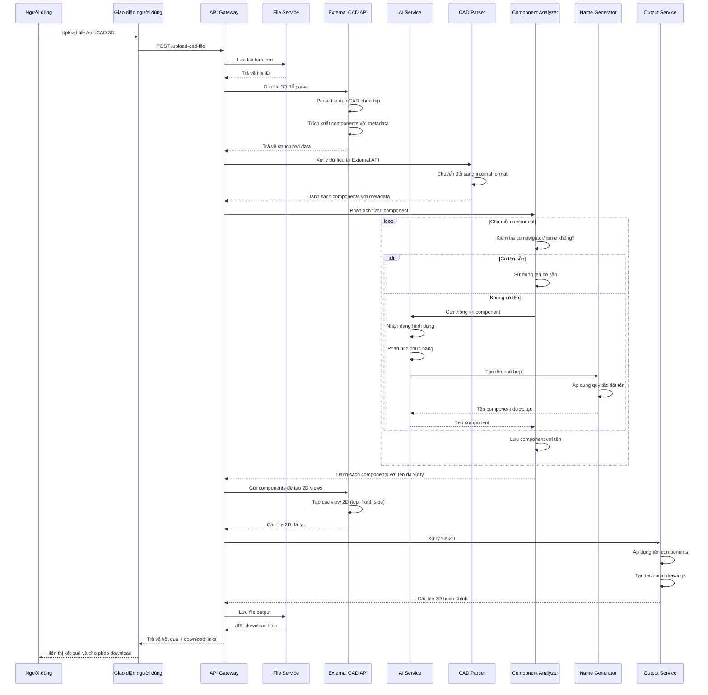

# Sequence Diagram - AutoCAD 3D to 2D AI Processing Flow

## Mô tả
Flow xử lý file AutoCAD 3D thành các file 2D với tích hợp AI để nhận dạng và đặt tên các thành phần.

## Sequence Diagram



## Các thành phần chính

### 1. File Service
- **Chức năng**: Quản lý upload/download files
- **Input**: File AutoCAD 3D
- **Output**: File ID, download URLs

### 2. External CAD API
- **Chức năng**: Parse file AutoCAD phức tạp (cần mở bằng AutoCAD)
- **Providers**: Autodesk Forge, ShareCAD, CADViewer360
- **Input**: File AutoCAD 3D
- **Output**: Structured data với components và metadata

### 3. CAD Parser
- **Chức năng**: Xử lý dữ liệu từ External API
- **Input**: Structured data từ External API
- **Output**: Danh sách components với metadata (internal format)

### 4. Component Analyzer
- **Chức năng**: Phân tích từng component để xác định có tên hay không
- **Logic**: 
  - Kiểm tra navigator/name properties
  - Nếu có → sử dụng tên có sẵn
  - Nếu không → gọi AI Service

### 5. AI Service
- **Chức năng**: Nhận dạng và phân tích hình dạng component
- **Input**: Thông tin component từ External API
- **Output**: Thông tin nhận dạng (hình dạng, chức năng)

### 6. Name Generator
- **Chức năng**: Tạo tên phù hợp cho component
- **Input**: Thông tin từ AI Service
- **Output**: Tên component theo quy tắc đặt tên

### 7. Output Service
- **Chức năng**: Xử lý file 2D từ External API và tạo technical drawings
- **Input**: File 2D từ External API + Components với tên đã xử lý
- **Output**: Các file 2D hoàn chỉnh (top view, front view, side view)

## Quy tắc đặt tên AI

### Khi không có tên sẵn:
1. **Phân tích hình dạng**: Hình tròn, vuông, tam giác, v.v.
2. **Phân tích chức năng**: Bearing, shaft, housing, v.v.
3. **Phân tích kích thước**: Large, small, medium
4. **Phân tích vị trí**: Top, bottom, left, right, center

### Format tên:
- `[Function]_[Shape]_[Size]_[Position]_[Index]`
- Ví dụ: `Bearing_Circle_Large_Top_01`

## API Endpoints

### 1. Upload CAD File
```
POST /api/cad/upload
Content-Type: multipart/form-data
Body: file (AutoCAD 3D file)
Response: { fileId: string, status: string }
```

### 2. Process CAD File
```
POST /api/cad/process
Body: { fileId: string }
Response: { processId: string, status: string }
```

### 3. Get Processing Status
```
GET /api/cad/process/{processId}/status
Response: { status: string, progress: number, message: string }
```

### 4. Download Results
```
GET /api/cad/process/{processId}/download
Response: { downloadUrls: string[], files: Array<{name: string, type: string}> }
```

## Error Handling

### 1. File Upload Errors
- File không đúng format
- File quá lớn
- File bị corrupt

### 2. Processing Errors
- Không parse được file
- AI service không available
- Component không nhận dạng được

### 3. Output Errors
- Không tạo được file 2D
- Lỗi trong quá trình convert

## Performance Considerations

1. **Async Processing**: Sử dụng background jobs cho việc xử lý
2. **Caching**: Cache kết quả AI cho các component tương tự
3. **Batch Processing**: Xử lý nhiều components cùng lúc
4. **Progress Tracking**: Real-time progress updates cho user

## Security Considerations

1. **File Validation**: Kiểm tra file type và size
2. **Sandbox Processing**: Chạy AI processing trong sandbox
3. **Data Privacy**: Không lưu trữ dữ liệu nhạy cảm
4. **Access Control**: Authentication và authorization
