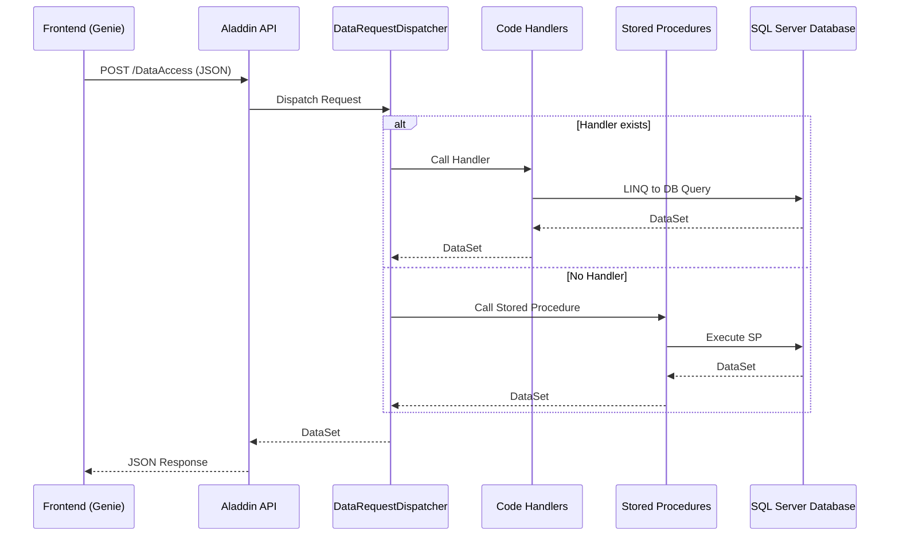

# ALADDIN - ARCHITECTURE & FLOW DOCUMENTATION

## 📋 Tổng quan dự án

Aladdin là một REST API backend được xây dựng bằng ASP.NET Core, cung cấp các dịch vụ cho frontend Genie. Dự án sử dụng kiến trúc hybrid kết hợp giữa Stored Procedures và Code-based handlers.

## 🏗️ Kiến trúc tổng quan



## 📁 Cấu trúc dự án

```
aladdin/
├── WebService/                    # 🚀 Main API Layer
│   ├── Program.cs                # Entry point & DI configuration
│   ├── DataAccessController.cs   # Main API endpoint
│   ├── DataRequestDispatcher.cs  # Request routing logic
│   ├── Api/                      # Additional API controllers
│   ├── Auth/                     # Authentication logic
│   ├── Configs/                  # Configuration classes
│   └── Adapters/                 # Request/Response adapters
│
├── WebService.Handlers/           # 🔧 Business Logic Layer
│   ├── GenericHandler.cs         # Base handler class
│   ├── QAHosGenericDB/          # Patient & Medical handlers
│   ├── Application/              # Application handlers
│   ├── FW/                       # Framework handlers
│   ├── HR/                       # HR handlers
│   ├── Integration/              # Integration handlers
│   ├── Reports/                  # Report handlers
│   └── Security/                 # Security handlers
│
├── Services/                      # 🛠️ Service Layer
├── Entities/                      # 📊 Data Models
├── Utilities/                     # 🔧 Utility classes
├── TestHelpers/                   # 🧪 Testing utilities
└── WebService.Handlers.Tests/     # 🧪 Handler tests
```

## 🔄 Luồng xử lý request

### 1. **Request Entry Point**
```csharp
// WebService/DataAccessController.cs
[HttpPost]
public object Post(ImmutableList<DataRequest> requests)
```

**Endpoint**: `POST /DataAccess`
**Authentication**: Session-based (Cookie: "s")
**Input**: JSON array of DataRequest objects

### 2. **Request Routing**
```csharp
// WebService/DataRequestDispatcher.cs
public DataSet Dispatch(AladdinDataConnection db, HistoryCentralDataConnection? historyDb,
    DataRequest request, string sessionId, Guid? userId)
```

**Logic**:
- Kiểm tra xem có handler code không
- Nếu có: Gọi handler code
- Nếu không: Gọi stored procedure
- Thêm SessionID vào parameters nếu cần

### 3. **Handler Resolution**
```csharp
// Handler Factory Pattern
handlerFactory.GetHandler(db, historyDb, request.Category, request.Command)
```

**Categories**:
- `QAHosGenericDB` - Patient & Medical data
- `Application` - Application logic
- `FW` - Framework functions
- `HR` - HR functions
- `Integration` - External integrations
- `Reports` - Reporting functions
- `Security` - Security functions

### 4. **Code Handler Execution**
```csharp
// Example: ws_MDM_Patient_CheckExists.cs
public class ws_MDM_Patient_CheckExists : GenericHandler<Parameters>
{
    public override DataSet Handle(Parameters @params)
    {
        // LINQ to DB queries
        // Business logic
        // Return DataSet
    }
}
```

### 5. **Stored Procedure Fallback**
```csharp
// If no handler exists, call stored procedure
CallStoredProcedure(db, request.Category, request.Command, request.Parameters)
```

## 🔌 API Endpoints

### Main Endpoint
- **URL**: `POST /DataAccess`
- **Auth**: Session-based authentication
- **Input**: Array of DataRequest objects
- **Output**: DataSet as JSON

### Additional Endpoints
- **Login**: `POST /Login` - Authentication
- **External APIs**: Various external integrations
- **Health Check**: `GET /healthz`

## 📊 DataRequest Structure

```json
{
  "Category": "QAHosGenericDB",
  "Command": "ws_MDM_Patient_CheckExists",
  "Parameters": {
    "PatientId": "guid",
    "PatientHospitalId": "string",
    "FacId": "string",
    "IsGetPatientInfor": true,
    "IsCheckFacId": true
  },
  "PreferStoredProcedure": false,
  "ExcludeSessionId": false
}
```

## 🗄️ Database Connections

### Primary Database
- **Connection**: `AladdinDataConnection`
- **Config**: `ConnectionStrings.Default`
- **Usage**: Main business data

### History Database
- **Connection**: `HistoryCentralDataConnection`
- **Config**: `ConnectionStrings.HistoryCentral`
- **Usage**: Historical data and audit trails

## 🔧 Configuration

### appsettings.json
```json
{
  "ConnectionStrings": {
    "Default": "Data Source=116.103.110.58,14433;User ID=duyphuc;Password=duy_phuc@123!vnvc;Trust Server Certificate=True",
    "HistoryCentral": "Data Source=116.103.110.58,14433;User ID=duyphuc;Password=duy_phuc@123!vnvc;Trust Server Certificate=True"
  },
  "ExternalConfigs": {
    "SpsTimeout": {},
    "SpsPreferred": []
  }
}
```

## 🚀 Development Workflow

### 1. **Chạy Backend**
```bash
cd WebService
dotnet run
```

### 2. **Access Swagger UI**
- **URL**: `http://localhost:5272/swagger/index.html`
- **Purpose**: API documentation & testing

### 3. **Testing**
```bash
# Run all tests
dotnet test

# Run specific test project
dotnet test WebService.Handlers.Tests
```

## 🔍 Debugging & Monitoring

### Logging
- **Framework**: Serilog
- **Levels**: Information, Warning, Error
- **Output**: Console, structured logging

### APM Integration
- **Tool**: Elastic APM
- **Features**: Performance monitoring, error tracking
- **Transaction naming**: Custom middleware for proper naming

### Health Checks
- **Endpoint**: `/healthz`
- **Checks**: Database connectivity, service health

## 🔐 Security

### Authentication
- **Method**: Session-based authentication
- **Cookie**: "s" (SessionID)
- **Validation**: Per-request session validation

### Authorization
- **Framework**: ASP.NET Core Authorization
- **Claims**: User ID, roles, permissions

## 📈 Performance Features

### Caching
- **Framework**: FusionCache
- **Strategy**: Handler-level caching
- **Interface**: `IResultCacheable`

### Database Optimization
- **Provider**: LINQ to DB
- **Hints**: `SqlServerHints.Table.NoLock`
- **Transactions**: Automatic transaction management

## 🧪 Testing Strategy

### Unit Tests
- **Framework**: xUnit.net
- **Location**: `WebService.Handlers.Tests/`
- **Database**: Test SQL Server image

### Test Structure
```
TestCases/
├── QAHosGenericDB/
│   ├── ws_MDM_Patient_CheckExists/
│   └── [other handlers]/
└── [other categories]/
```

## 🔄 Migration Strategy

### Stored Procedure → Code
1. **Analysis**: Review SP logic
2. **Implementation**: Create handler class
3. **Testing**: Verify with test cases
4. **Deployment**: Gradual migration

### Handler Template
```csharp
public class ws_HandlerName : GenericHandler<Parameters>
{
    public class Parameters
    {
        // Input parameters
    }

    public override DataSet Handle(Parameters @params)
    {
        // Business logic
        // Database queries
        // Return DataSet
    }
}
```

## 📚 Key Files

### Core Files
- `Program.cs` - Application startup
- `DataAccessController.cs` - Main API endpoint
- `DataRequestDispatcher.cs` - Request routing
- `GenericHandler.cs` - Base handler class

### Configuration Files
- `appsettings.json` - Main configuration
- `appsettings.Development.json` - Development settings
- `ServiceCollectionExtensions.cs` - DI configuration

### Handler Examples
- `ws_MDM_Patient_CheckExists.cs` - Patient validation
- `ws_Vaccine_ChiDinhVaccine.cs` - Vaccine management
- `ws_PKN_KhamBenh_Save.cs` - Medical examination

## 🎯 Best Practices

### Code Organization
1. **Handlers**: One file per business function
2. **Naming**: `ws_` prefix for handlers
3. **Parameters**: Strongly typed parameter classes
4. **Error Handling**: Try-catch with proper logging

### Database Access
1. **LINQ to DB**: Preferred over raw SQL
2. **NoLock Hints**: For read operations
3. **Transactions**: Automatic management
4. **Connection Pooling**: Built-in optimization

### Performance
1. **Caching**: Use `IResultCacheable` interface
2. **Async/Await**: For I/O operations
3. **Connection Management**: Proper disposal
4. **Query Optimization**: Use appropriate indexes

---

## 🔗 Related Documentation

- [HANDLERS.md](./HANDLERS.md) - Handler development guide
- [README.md](./README.md) - Project overview
- [Test Documentation](./TestHelpers/) - Testing guidelines


## �� Tóm tắt những gì đã tạo:

### 🏗️ **Kiến trúc tổng quan**:
- **Frontend (Genie)** → **Aladdin API** → **Database**
- **Hybrid Architecture**: Kết hợp Code Handlers + Stored Procedures
- **Request Flow**: DataAccessController → DataRequestDispatcher → Handlers/SP

### 🔄 **Luồng xử lý chính**:
1. **Entry Point**: `POST /DataAccess` với JSON array
2. **Routing**: DataRequestDispatcher quyết định gọi Handler hay SP
3. **Execution**: Handler code hoặc Stored Procedure
4. **Response**: DataSet trả về dưới dạng JSON

### �� **Cấu trúc dự án**:
- **WebService/**: API layer (Controllers, Dispatcher)
- **WebService.Handlers/**: Business logic (QAHosGenericDB, Application, etc.)
- **Services/**: Service layer
- **Entities/**: Data models
- **Utilities/**: Helper classes

### 🔌 **API Endpoints**:
- **Main**: `POST /DataAccess` - Xử lý tất cả business requests
- **Auth**: `POST /Login` - Authentication
- **Health**: `GET /healthz` - Health check
- **Swagger**: `http://localhost:5272/swagger/index.html`

### 🗄️ **Database**:
- **Primary**: AladdinDataConnection (main business data)
- **History**: HistoryCentralDataConnection (audit trails)
- **Config**: Connection strings trong appsettings.json

### �� **Development**:
- **Run**: `dotnet run --project WebService`
- **Test**: `dotnet test`
- **Swagger**: `http://localhost:5272/swagger/index.html`
