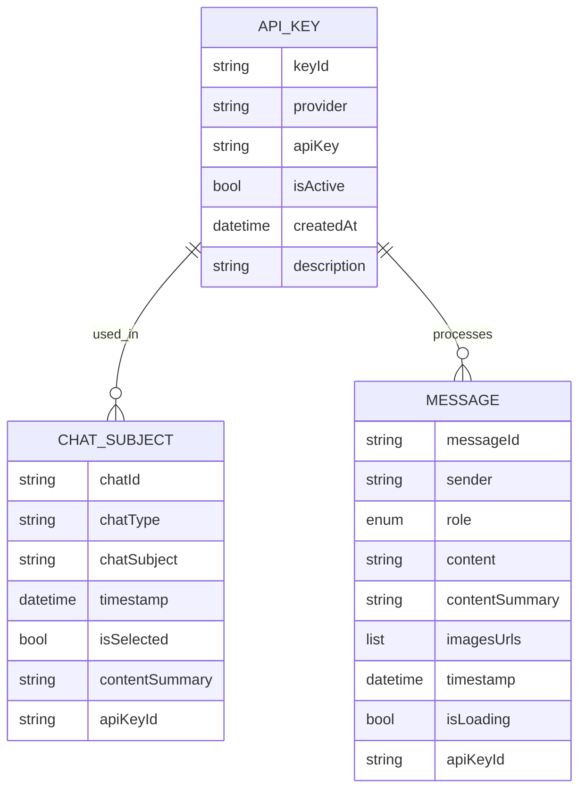
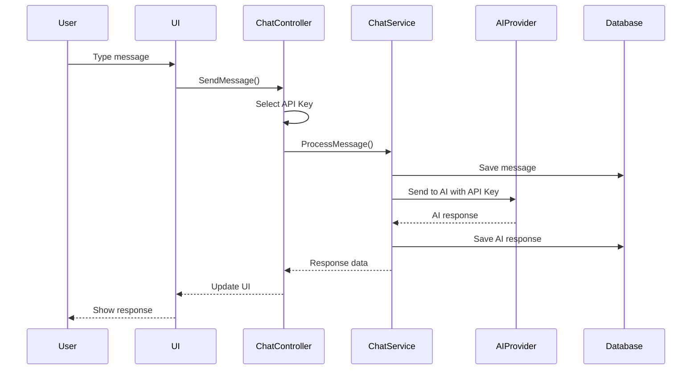
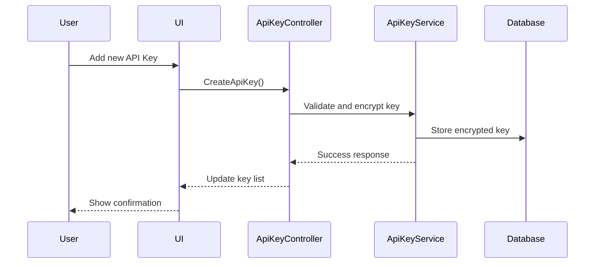

# Technical Design Document: CHATAIYOOT - AI Chat Application

## 1. Overview

CHATAIYOOT là một ứng dụng chat AI được xây dựng bằng Flutter, cung cấp trải nghiệm trò chuyện AI hiện đại, dễ sử dụng và dễ mở rộng. Ứng dụng hỗ trợ nhiều loại chat (text, video, youtube) và tích hợp với nhiều AI provider khác nhau thông qua API keys.

## 2. Requirements

### 2.1 Functional Requirements

* **Chat Management**: Người dùng có thể tạo, quản lý và tham gia các cuộc trò chuyện
* **Multi-Modal Chat**: Hỗ trợ chat text, video, youtube và các loại nội dung khác
* **API Key Management**: Người dùng có thể quản lý và sử dụng nhiều API keys từ các AI provider khác nhau
* **Message Handling**: Hỗ trợ gửi/nhận tin nhắn với AI responses, hình ảnh và nội dung đa phương tiện
* **Real-time Communication**: Giao tiếp real-time với AI services
* **Multi-language Support**: Hỗ trợ đa ngôn ngữ (tiếng Việt và tiếng Anh)

### 2.2 Non-Functional Requirements

* **Performance**: Ứng dụng phải phản hồi trong vòng 2 giây cho các thao tác cơ bản
* **Scalability**: Hỗ trợ tối thiểu 1000 người dùng đồng thời
* **Security**: Mã hóa dữ liệu nhạy cảm và bảo vệ API keys
* **Availability**: Uptime 99.9% với khả năng phục hồi từ lỗi
* **Cross-platform**: Hỗ trợ web, iOS và Android
* **Offline Support**: Có thể hoạt động offline với cache local

## 3. Technical Design

### 3.1. Data Model Changes

#### Core Entities

**API Key Entity**:


**Chat Subject Entity** (`startLine: 1`, `endLine: 173` in `lib/features/chat/data/models/chat_subject_model.dart`):
- Quản lý các cuộc trò chuyện với metadata
- Hỗ trợ nhiều loại chat (text, video, youtube)
- Tracking trạng thái và nội dung tóm tắt
- Liên kết với API key được sử dụng

**Message Entity** (`startLine: 1`, `endLine: 98` in `lib/features/chat/data/models/message.dart`):
- Xử lý tin nhắn hai chiều giữa user và AI
- Hỗ trợ nội dung đa phương tiện
- Tracking trạng thái loading và error handling
- Liên kết với API key xử lý tin nhắn

### 3.2. API Changes

#### Chat API Endpoints

**Create Chat Session**:
```json
POST /api/chat/session
{
  "chatType": "text",
  "chatSubject": "AI Assistant Help",
  "apiKeyId": "key_789"
}

Response:
{
  "chatId": "chat_456",
  "status": "created",
  "timestamp": "2024-01-15T10:30:00Z"
}
```

**Send Message**:
```json
POST /api/chat/{chatId}/message
{
  "content": "Hello, how can you help me?",
  "sender": "user",
  "apiKeyId": "key_789"
}

Response:
{
  "messageId": "msg_123",
  "aiResponse": "Hi! I'm here to help you...",
  "timestamp": "2024-01-15T10:31:00Z"
}
```

**Get Chat History**:
```json
GET /api/chat/{chatId}/messages?limit=50&offset=0

Response:
{
  "messages": [...],
  "hasMore": true,
  "totalCount": 150
}
```

#### API Key Management Endpoints

**Create API Key**:
```json
POST /api/apikeys
{
  "provider": "openai",
  "apiKey": "sk-...",
  "description": "OpenAI GPT-4 Key"
}

Response:
{
  "keyId": "key_123",
  "provider": "openai",
  "isActive": true,
  "createdAt": "2024-01-15T10:30:00Z"
}
```

**List API Keys**:
```json
GET /api/apikeys

Response:
{
  "keys": [
    {
      "keyId": "key_123",
      "provider": "openai",
      "isActive": true,
      "description": "OpenAI GPT-4 Key"
    }
  ]
}
```

### 3.3. UI Changes

#### Chat Interface Components

**ChatScreen** (`lib/features/chat/presentation/views/`):
- Message list với infinite scroll
- Input field với support cho text và image URLs
- Real-time typing indicators
- Message status indicators (sent, delivered, read)
- API key selector cho mỗi tin nhắn

**ChatSubjectList** (`lib/features/chat/presentation/views/`):
- Danh sách các cuộc trò chuyện
- Search và filter functionality
- Drag & drop để sắp xếp
- Quick actions (pin, archive, delete)

**API Key Management** (`lib/features/api_management/presentation/`):
- CRUD operations cho API keys
- Provider selection (OpenAI, Grok, Claude)
- Usage statistics và billing
- Security settings

### 3.4. Logic Flow

#### Chat Message Flow


#### API Key Management Flow


### 3.5. Dependencies

#### Flutter Dependencies
- **State Management**: `get: ^4.7.2` (GetX pattern)
- **HTTP Client**: `http: ^1.4.0`
- **Storage**: `shared_preferences: ^2.5.2`
- **UI Components**: `flutter_markdown: ^0.7.2`, `lottie: ^3.3.1`
- **Encryption**: `encrypt: ^5.0.3` (for API key security)

#### External Services
- **AI Providers**: OpenAI API, Grok API, Claude API
- **Local Storage**: SharedPreferences cho API keys và settings

### 3.6. Security Considerations

* **API Key Encryption**: Sử dụng `encrypt: ^5.0.3` để mã hóa API keys trong local storage
* **Input Validation**: Sanitize user input để prevent XSS và injection attacks
* **HTTPS Only**: Tất cả API calls phải sử dụng HTTPS
* **Rate Limiting**: Implement rate limiting cho API endpoints
* **Data Privacy**: Tuân thủ GDPR và các quy định bảo mật dữ liệu
* **Key Rotation**: Hỗ trợ thay đổi API keys định kỳ

### 3.7. Performance Considerations

* **Lazy Loading**: Implement lazy loading cho chat history và images
* **Caching Strategy**: Cache AI responses và user preferences locally
* **Image Optimization**: Optimize image URLs cho performance
* **Pagination**: Implement pagination cho message history
* **Background Processing**: Process AI responses trong background threads
* **Memory Management**: Efficient memory usage cho large chat histories

## 4. Testing Plan

### Unit Testing
* **Model Tests**: Test data serialization/deserialization cho tất cả models
* **Service Tests**: Test business logic trong ChatService và ApiKeyService
* **Controller Tests**: Test state management trong GetX controllers

### Integration Testing
* **API Integration**: Test communication với external AI providers
* **Database Integration**: Test data persistence và retrieval
* **Local Storage**: Test API key encryption/decryption

### UI Testing
* **Widget Tests**: Test individual UI components
* **Integration Tests**: Test complete user flows
* **Cross-platform Tests**: Test trên web, iOS và Android

### Performance Testing
* **Load Testing**: Test với nhiều concurrent users
* **Memory Testing**: Test memory usage với large datasets
* **Network Testing**: Test performance với slow network conditions

## 5. Open Questions

* **AI Provider Selection**: Làm thế nào để user chọn AI provider phù hợp nhất cho từng use case?
* **Offline Mode**: Cần implement offline mode như thế nào để user có thể tiếp tục chat khi mất kết nối?
* **Multi-language Support**: Cần support bao nhiêu ngôn ngữ và làm thế nào để implement localization?
* **Scalability**: Làm thế nào để handle 10,000+ concurrent users?
* **Cost Management**: Làm thế nào để user track và control AI API usage costs?

## 6. Alternatives Considered

### State Management
* **Alternative**: Provider/Riverpod pattern
* **Rejected**: GetX được chọn vì đơn giản và hiệu quả cho dự án này

### AI Integration
* **Alternative**: Direct API integration với từng provider
* **Rejected**: Unified AI service layer được chọn để dễ maintain và extend

### Database
* **Alternative**: SQLite local database
* **Rejected**: Local storage với encryption được chọn vì đơn giản và bảo mật

## 7. Implementation Timeline

### Phase 1 (Weeks 1-4): Core Infrastructure
* Setup project structure và dependencies
* Implement API key management system
* Create basic data models

### Phase 2 (Weeks 5-8): Chat Functionality
* Implement chat UI components
* Create message handling system
* Integrate with AI providers

### Phase 3 (Weeks 9-12): Advanced Features
* Add multi-modal chat support
* Implement chat history management
* Add search và filter functionality

### Phase 4 (Weeks 13-16): Testing & Optimization
* Comprehensive testing
* Performance optimization
* Bug fixes và refinements

## 8. Risk Assessment

### High Risk
* **AI Provider API Changes**: External API changes có thể break functionality
* **Performance Issues**: Large chat histories có thể cause memory issues

### Medium Risk
* **Security Vulnerabilities**: API key exposure và encryption bypass
* **Cross-platform Compatibility**: UI differences giữa platforms

### Low Risk
* **Dependency Updates**: Flutter và package updates
* **Third-party Service Outages**: AI provider downtime

## 9. Success Metrics

* **User Engagement**: Average session duration > 10 minutes
* **Performance**: App startup time < 3 seconds
* **Reliability**: Crash rate < 0.1%
* **User Satisfaction**: App store rating > 4.5 stars
* **Adoption**: 1000+ active users trong 6 tháng đầu
