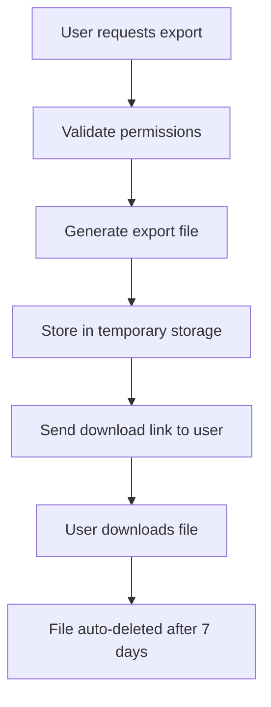
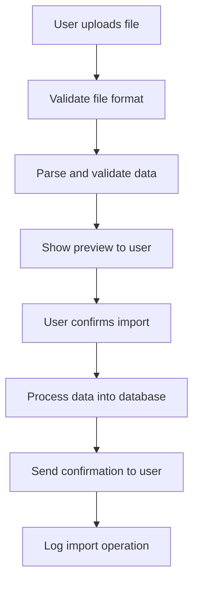
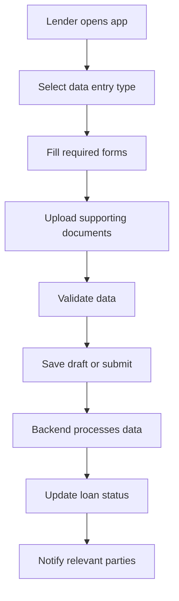

# IMPORT/EXPORT DATA INTEGRATION - BUSINESS REQUIREMENTS
## Loan Management App với lend.com.au Integration

---

## 📊 TỔNG QUAN YÊU CẦU MỞ RỘNG

**Tên tính năng:** Import/Export Data Integration với lend.com.au  
**Mục tiêu:** Tích hợp dữ liệu hai chiều giữa hệ thống nội bộ và lend.com.au  
**Phạm vi:** Mobile App, Backend API, Database Integration  
**Thời gian ước tính:** 3-4 tuần development  

---

## 🎯 YÊU CẦU CHI TIẾT

### 1. EXPORT DATA (Xuất dữ liệu từ hệ thống nội bộ)

#### 1.1 Mô tả nghiệp vụ
- **Mục đích:** Xuất thông tin user từ database nội bộ để import vào lend.com.au
- **Trigger:** User yêu cầu xuất dữ liệu hoặc admin thực hiện bulk export
- **Format:** CSV/Excel hoặc JSON theo chuẩn lend.com.au API

#### 1.2 Dữ liệu cần xuất
- **User Profile Data:**
  - Personal information (name, email, phone, address)
  - Identity documents (ID, passport)
  - Financial information (income, employment)
  - Credit history và loan applications

- **Loan Data:**
  - Loan applications và status
  - Payment history
  - Outstanding balances
  - Risk assessment scores

#### 1.3 Giao diện người dùng
- **Mobile App:** Export button trong user profile hoặc loan details
- **Admin Panel:** Bulk export functionality với filtering options
- **Progress tracking:** Real-time progress bar cho large exports

### 2. IMPORT DATA (Nhập dữ liệu từ lend.com.au)

#### 2.1 Mô tả nghiệp vụ
- **Mục đích:** Import dữ liệu mới từ lend.com.au vào hệ thống nội bộ
- **Trigger:** User upload file hoặc scheduled import
- **Format:** CSV/Excel/JSON theo chuẩn lend.com.au

#### 2.2 Dữ liệu cần nhập
- **New Loan Applications:**
  - Customer information
  - Loan details (amount, term, interest rate)
  - Supporting documents
  - Risk assessment data

- **Updated Information:**
  - Customer profile updates
  - Payment status changes
  - Loan status modifications

#### 2.3 Giao diện người dùng
- **Mobile App:** File upload interface với drag & drop
- **Admin Panel:** Bulk import với data validation
- **Error handling:** Detailed error reports và correction suggestions

### 3. COMMERCIAL LENDER INTERFACE

#### 3.1 Mô tả nghiệp vụ
- **Mục đích:** Giao diện nhập liệu cho commercial lenders từ mobile app
- **Target users:** Commercial lenders, loan officers, brokers
- **Workflow:** Direct data entry từ mobile app đến backend

#### 3.2 Tính năng chính
- **Data Entry Forms:**
  - Customer information forms
  - Loan application forms
  - Document upload interface
  - Real-time validation

- **Workflow Management:**
  - Multi-step form process
  - Save draft functionality
  - Review và approval workflow
  - Status tracking

#### 3.3 Giao diện người dùng
- **Mobile App:** Specialized lender interface
- **Form validation:** Real-time validation với error messages
- **Offline support:** Save drafts khi không có internet
- **Sync functionality:** Auto-sync khi có connection

---

## 🔧 TECHNICAL SPECIFICATIONS

### 1. Backend API Requirements

#### 1.1 Export API Endpoints
```
POST /api/export/user-data
POST /api/export/loan-data
GET /api/export/status/{exportId}
GET /api/export/download/{exportId}
```

#### 1.2 Import API Endpoints
```
POST /api/import/upload-file
POST /api/import/validate-data
POST /api/import/process-data
GET /api/import/status/{importId}
```

#### 1.3 Commercial Lender API Endpoints
```
POST /api/lender/customer-data
PUT /api/lender/customer-data/{id}
POST /api/lender/loan-application
GET /api/lender/applications
```

### 2. Database Schema Changes

#### 2.1 New Tables
- **export_logs:** Track export operations
- **import_logs:** Track import operations
- **data_mapping:** Map fields between systems
- **lender_sessions:** Track lender data entry sessions

#### 2.2 Modified Tables
- **users:** Add export/import flags
- **loans:** Add external system references
- **documents:** Add source system tracking

### 3. File Processing

#### 3.1 Supported Formats
- **CSV:** Comma-separated values
- **Excel:** .xlsx, .xls files
- **JSON:** Structured data format
- **XML:** For complex data structures

#### 3.2 Data Validation
- **Field validation:** Required fields, data types
- **Business rules:** Loan amount limits, term validation
- **Duplicate detection:** Prevent duplicate entries
- **Data integrity:** Foreign key constraints

---

## 💰 COST BREAKDOWN

### 1. Development Costs

| Feature | Complexity | Hours | Rate (AUD/hour) | Total Cost (AUD) |
|---------|------------|-------|-----------------|------------------|
| **Export Data System** | Medium | 40 hours | $50 | $2,000 |
| **Import Data System** | High | 60 hours | $50 | $3,000 |
| **Commercial Lender Interface** | High | 50 hours | $50 | $2,500 |
| **Data Validation & Error Handling** | Medium | 30 hours | $50 | $1,500 |
| **API Integration với lend.com.au** | High | 40 hours | $50 | $2,000 |
| **Testing & Quality Assurance** | Medium | 25 hours | $50 | $1,250 |
| **Documentation & Training** | Low | 15 hours | $50 | $750 |

**Tổng chi phí development:** $13,000 AUD

### 2. Additional Infrastructure Costs

| Item | Cost | Frequency | Notes |
|------|------|-----------|-------|
| **File Storage (S3)** | $20/month | Monthly | For import/export files |
| **Data Processing (Lambda)** | $15/month | Monthly | For file processing |
| **Monitoring & Logging** | $10/month | Monthly | For operation tracking |

**Tổng chi phí infrastructure:** $45/month

### 3. Maintenance & Support

| Service | Cost | Frequency | Notes |
|---------|------|-----------|-------|
| **Bug fixes & updates** | $100/hour | As needed | Post-warranty |
| **Feature enhancements** | $150/hour | As needed | Additional requirements |
| **Data migration support** | $200/hour | As needed | One-time setup |

---

## 📋 IMPLEMENTATION TIMELINE

### Phase 1: Export System (1.5 tuần)
- **Week 1:** Backend API development
- **Week 2:** Mobile app integration & testing

### Phase 2: Import System (2 tuần)
- **Week 1:** File processing & validation
- **Week 2:** Mobile app interface & testing

### Phase 3: Commercial Lender Interface (1.5 tuần)
- **Week 1:** Form development & validation
- **Week 2:** Workflow integration & testing

### Phase 4: Integration & Testing (1 tuần)
- **Week 1:** End-to-end testing & documentation

---

## 🔄 BUSINESS WORKFLOW

### 1. Export Workflow


### 2. Import Workflow


### 3. Commercial Lender Workflow


---

## ⚠️ RISK ASSESSMENT

### 1. Technical Risks
- **Data format changes:** lend.com.au API changes
- **File size limits:** Large import/export files
- **Data corruption:** During transfer process
- **Performance impact:** Large data operations

### 2. Business Risks
- **Data privacy:** Sensitive financial information
- **Compliance:** Financial regulations
- **User adoption:** Learning curve for new features
- **Integration complexity:** Multiple system dependencies

### 3. Mitigation Strategies
- **Version control:** API versioning strategy
- **Chunked processing:** Handle large files in batches
- **Data validation:** Multiple validation layers
- **Performance monitoring:** Real-time system monitoring
- **User training:** Comprehensive documentation
- **Backup procedures:** Data backup before operations

---

## 📊 SUCCESS METRICS

### 1. Technical Metrics
- **Export success rate:** >95%
- **Import success rate:** >90%
- **Processing time:** <5 minutes for 1000 records
- **System uptime:** >99.5%

### 2. Business Metrics
- **User adoption rate:** >80% of target users
- **Data accuracy:** >99% accuracy in transfers
- **User satisfaction:** >4.5/5 rating
- **Support tickets:** <5% of operations

---

## 📝 NEXT STEPS

### 1. Immediate Actions
- [ ] Review và approve business requirements
- [ ] Finalize technical specifications
- [ ] Set up development environment
- [ ] Create project timeline

### 2. Development Phase
- [ ] Backend API development
- [ ] Mobile app integration
- [ ] Testing và quality assurance
- [ ] Documentation creation

### 3. Deployment Phase
- [ ] Production deployment
- [ ] User training
- [ ] Monitoring setup
- [ ] Support procedures

---

**Tài liệu này cung cấp cơ sở hoàn chỉnh để phát triển tính năng import/export data integration với lend.com.au, bao gồm tất cả yêu cầu nghiệp vụ, chi phí và timeline.**
