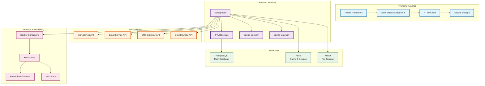

# Loan Management App 

## Tổng quan hệ thống

Đây là kiến trúc tổng thể của Loan Management App:

## 0. High-Level System Architecture

## 1. Technology Stack

## 2. Tóm tắt kiến trúc

### Các thành phần chính:

1. **Users & Client Applications**
   - **Customer**: Mobile app users (iOS & Android)
   - **Admin**: Web dashboard users
   - **Staff**: Loan officers và support staff
   - **Mobile App**: Flutter application với GetX state management
   - **Web Panel**: React/Vue.js admin interface

2. **API Layer & Gateway**
   - **Load Balancer**: Nginx/HAProxy cho traffic distribution
   - **API Gateway**: Spring Cloud Gateway cho routing và authentication
   - **Authentication Service**: JWT + OAuth2 integration

3. **Core Business Services**
   - **User Management Service**: Customer profiles, roles, permissions
   - **Loan Processing Service**: Application workflow, approval process
   - **Payment Processing Service**: Payment collection, scheduling
   - **Notification Service**: Multi-channel notifications (Push, Email, SMS)
   - **Document Management Service**: File upload, storage, verification
   - **Reporting & Analytics Service**: Business intelligence, dashboards

4. **Firebase Integration**
   - **Authentication**: User login, registration, social auth
   - **Analytics**: User behavior tracking, app performance
   - **Crashlytics**: Error monitoring và crash reporting
   - **Cloud Messaging**: Push notifications
   - **Cloud Storage**: Document và file storage

5. **External Services**
   - **loan.com.us API**: Sandbox environment integration
   - **Email Provider**: SendGrid/AWS SES cho email notifications
   - **SMS Provider**: Twilio/AWS SNS cho SMS notifications
   - **Payment Gateway**: VNPay/MoMo cho payment processing
   - **Credit Bureau**: CIC API cho credit scoring

6. **Data Storage**
   - **PostgreSQL**: Main database cho business data
   - **Redis**: Cache và session management
   - **MinIO**: File storage cho documents
   - **Elasticsearch**: Search functionality và log analysis

7. **Infrastructure**
   - **Docker**: Containerization
   - **Kubernetes**: Container orchestration
   - **Monitoring**: Prometheus + Grafana
   - **Logging**: ELK Stack (Elasticsearch, Logstash, Kibana)

### Luồng xử lý chính:

1. **Loan Application Flow**: Draft → Submitted → Verification → Underwriting → Approval → Disbursement → Servicing → Closure
2. **User Management**: Guest → Member với các quyền khác nhau
3. **Notification System**: Multi-channel (Push, Email, SMS, In-app) với user preferences
4. **Data Flow**: Mobile App ↔ API Gateway ↔ Core Services ↔ Database

Kiến trúc này đảm bảo tính mở rộng, bảo mật và dễ bảo trì cho hệ thống Loan Management App.
