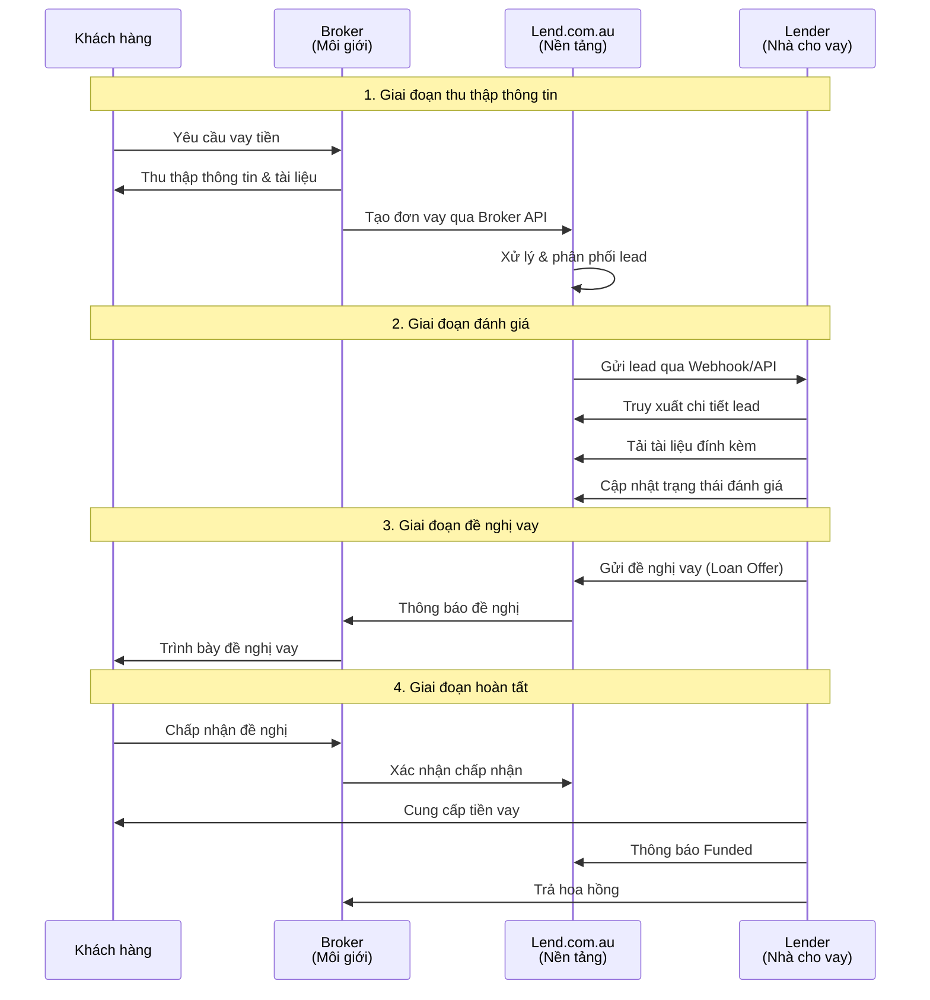
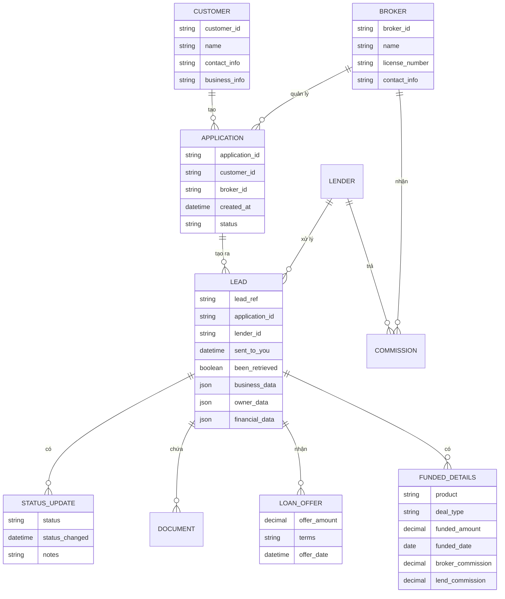

# Diagram Mối quan hệ Lender - Broker trong hệ thống Lend.com.au

## Luồng hoạt động chính



## Kiến trúc hệ thống

```mermaid
graph TB
    subgraph "Khách hàng"
        C[Customer<br/>Cần vay tiền]
    end
    
    subgraph "Broker Ecosystem"
        B[Broker<br/>Môi giới tài chính]
        BAPI[Broker API<br/>broker-api-docs.lend.com.au]
    end
    
    subgraph "Lend.com.au Platform"
        LP[Lend Platform<br/>Trung tâm xử lý]
        LAPI[Lender API<br/>lenders-api.lend.com.au]
    end
    
    subgraph "Lender Ecosystem"
        L[Lender<br/>Nhà cho vay<br/>(Công ty bạn)]
        LDB[(Lender Database)]
    end
    
    C -->|1. Yêu cầu vay| B
    B -->|2. Tạo đơn vay| BAPI
    BAPI -->|3. Xử lý lead| LP
    LP -->|4. Phân phối lead| LAPI
    LAPI -->|5. Nhận lead| L
    L -->|6. Lưu trữ| LDB
    L -->|7. Cập nhật trạng thái| LAPI
    LAPI -->|8. Thông báo| LP
    LP -->|9. Thông báo| BAPI
    BAPI -->|10. Thông báo| B
    B -->|11. Thông báo| C
```

## Mối quan hệ dữ liệu



## Luồng API chính

```mermaid
flowchart TD
    subgraph "Broker API Flow"
        B1[POST /applications<br/>Tạo đơn vay]
        B2[GET /applications/{id}/status<br/>Theo dõi trạng thái]
        B3[POST /documents<br/>Upload tài liệu]
    end
    
    subgraph "Lender API Flow"
        L1[GET /leads?since=timestamp<br/>Lấy danh sách lead]
        L2[GET /leads/{lead_ref}<br/>Lấy chi tiết lead]
        L3[GET /leads/get-attachments/{lead_ref}<br/>Tải tài liệu]
        L4[POST /leads/{lead_ref}<br/>Cập nhật trạng thái]
        L5[POST /leads/{lead_ref}<br/>Gửi đề nghị vay]
        L6[POST /leads/{lead_ref}<br/>Thông báo Funded]
    end
    
    B1 --> L1
    L1 --> L2
    L2 --> L3
    L3 --> L4
    L4 --> L5
    L5 --> B2
    L5 --> L6
    L6 --> B2
```

## Tóm tắt mối quan hệ

### Broker (Môi giới):
- **Vai trò**: Trung gian giữa khách hàng và nhà cho vay
- **Chức năng**: Tìm khách hàng, thu thập hồ sơ, gửi đến nhà cho vay
- **Lợi ích**: Nhận hoa hồng khi giao dịch thành công
- **API**: Sử dụng Broker API để tạo và quản lý đơn vay

### Lender (Nhà cho vay):
- **Vai trò**: Cung cấp tiền vay cho khách hàng
- **Chức năng**: Đánh giá hồ sơ, quyết định cho vay, cung cấp tiền
- **Lợi ích**: Thu lãi từ khoản vay
- **API**: Sử dụng Lender API để nhận lead và cập nhật trạng thái

### Lend.com.au Platform:
- **Vai trò**: Nền tảng kết nối broker và lender
- **Chức năng**: Xử lý, phân phối lead, quản lý luồng giao dịch
- **Lợi ích**: Thu phí từ cả broker và lender
