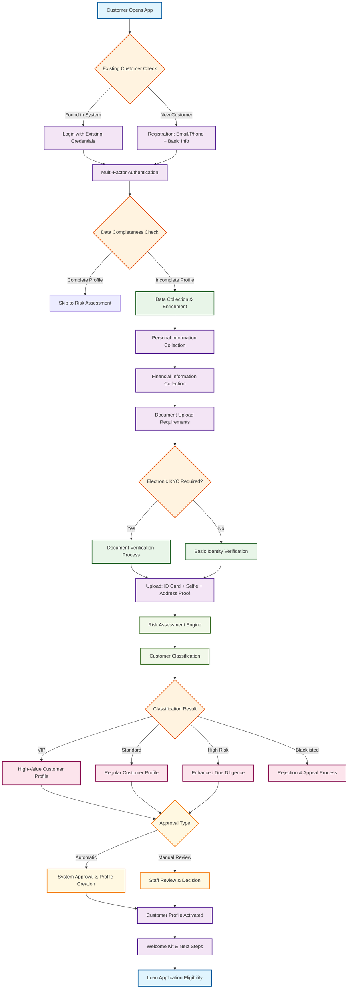

# Customer Onboarding Flow - Loan Management System

## Overview
This diagram shows the complete customer onboarding process for a loan management system, including data collection, verification, risk assessment, and profile creation. The flow integrates with existing customer data systems and follows financial industry compliance standards.

## System Architecture Context

### Data Sources Integration
- **Existing Customer Database**: Lend.com.au legacy system
- **External Data Providers**: Credit bureaus, identity verification services
- **Document Storage**: Secure cloud storage for KYC documents
- **Risk Assessment Engine**: AI-powered credit scoring system

### Data Flow Points
- **Customer Lookup**: Check existing profiles across systems
- **Data Enrichment**: Augment customer information from multiple sources
- **Risk Profiling**: Generate comprehensive risk assessment
- **Compliance Check**: Verify regulatory requirements

## Flow Diagram

## Detailed Process Flow

### 1. Customer Identification & Authentication
- **Existing Customer Lookup**: 
  - Check Lend.com.au database
  - Verify customer history and loan status
  - Retrieve existing profile data
- **New Customer Registration**: 
  - Collect basic contact information
  - Validate email/phone uniqueness
  - Create initial customer record

### 2. Multi-Factor Authentication
- **OTP Verification**: SMS/Email-based verification
- **Device Recognition**: Trusted device management
- **Session Security**: Secure token generation

### 3. Data Collection & Enrichment
- **Personal Information**:
  - Full name, date of birth, nationality
  - Contact details and address history
  - Employment and income information
- **Financial Information**:
  - Bank account details
  - Income sources and stability
  - Existing financial obligations
- **Document Requirements**:
  - Government-issued ID (CMND/CCCD)
  - Proof of address (utility bills, rental agreement)
  - Income verification (payslips, bank statements)
  - Selfie photo for identity verification

### 4. KYC & Verification Process
- **Electronic KYC (e-KYC)**:
  - Automated document verification
  - Facial recognition and liveness detection
  - Address verification through multiple sources
- **Manual Verification**:
  - Staff review for complex cases
  - Additional document requests if needed
  - Escalation for suspicious activities

### 5. Risk Assessment & Classification
- **Risk Engine Analysis**:
  - Credit bureau data integration
  - Financial behavior analysis
  - Fraud detection algorithms
  - Regulatory compliance checks
- **Customer Classification**:
  - **VIP**: High credit score, stable income, good payment history
  - **Standard**: Meets basic requirements, moderate risk
  - **High Risk**: Requires additional verification, enhanced due diligence
  - **Blacklisted**: Previous fraud, default, or compliance violations

### 6. Approval Workflow
- **Automatic Approval**:
  - Low-risk customers with complete profiles
  - Standard loan products
  - System-generated approval decisions
- **Manual Review**:
  - High-risk customers
  - Complex financial situations
  - Staff assessment and decision making

### 7. Profile Activation & Onboarding
- **Profile Creation**:
  - Complete customer record setup
  - Risk profile assignment
  - Product eligibility determination
- **Welcome Process**:
  - Welcome kit and documentation
  - Product education and next steps
  - Customer support contact information

## Data Integration Points

### Internal Systems
- **Customer Database**: Core customer information storage
- **Loan Management System**: Application and loan tracking
- **Risk Management**: Credit scoring and risk assessment
- **Document Management**: Secure file storage and retrieval
- **Compliance Engine**: Regulatory requirement verification

### External Services
- **Credit Bureaus**: Credit history and score data
- **Identity Verification**: Government ID validation services
- **Address Verification**: Geographic and postal validation
- **Fraud Detection**: AI-powered fraud prevention services
- **Regulatory Reporting**: Compliance and reporting systems

## Business Rules & Compliance

### Data Validation Rules
1. **Required Fields**: All mandatory fields must be completed
2. **Data Accuracy**: Information must be verified through multiple sources
3. **Document Authenticity**: All documents must pass verification checks
4. **Address Verification**: Physical address must be confirmed
5. **Income Validation**: Income must be verified through official sources

### Risk Assessment Criteria
1. **Credit Score**: Minimum acceptable credit score thresholds
2. **Income Stability**: Employment history and income consistency
3. **Debt-to-Income Ratio**: Maximum acceptable debt burden
4. **Payment History**: Previous loan and credit payment behavior
5. **Fraud Indicators**: Suspicious activity detection

### Compliance Requirements
1. **KYC Regulations**: Know Your Customer requirements
2. **Anti-Money Laundering**: AML compliance checks
3. **Data Protection**: GDPR and local privacy regulations
4. **Financial Regulations**: Banking and lending compliance
5. **Document Retention**: Required document storage periods

## Success Metrics & KPIs

### Onboarding Performance
- **Completion Rate**: > 90% of started applications completed
- **Processing Time**: < 20 minutes for standard applications
- **Document Verification Success**: > 95% first-time approval
- **Customer Satisfaction**: > 4.5/5 rating

### Risk Management
- **Fraud Detection Rate**: > 98% accuracy
- **False Positive Rate**: < 2% of legitimate customers
- **Risk Classification Accuracy**: > 95% precision
- **Compliance Violation Rate**: < 0.1%

### Operational Efficiency
- **Automated Approval Rate**: > 70% of applications
- **Manual Review Time**: < 4 hours average
- **Data Quality Score**: > 95% accuracy
- **System Uptime**: > 99.9% availability

## Error Handling & Exception Management

### Common Error Scenarios
1. **Document Verification Failure**: Retry with alternative documents
2. **Address Verification Issues**: Manual address confirmation
3. **Income Verification Problems**: Additional documentation requests
4. **System Integration Failures**: Fallback to manual processes
5. **Compliance Violations**: Escalation to compliance team

### Exception Workflows
- **Data Inconsistencies**: Automated flagging and manual review
- **Document Quality Issues**: Customer notification and re-upload
- **System Failures**: Graceful degradation and manual processing
- **Compliance Issues**: Immediate escalation and investigation
- **Fraud Suspicions**: Security team notification and account freezing

## Future Enhancements

### Technology Improvements
- **AI-Powered Verification**: Enhanced document and identity verification
- **Blockchain Integration**: Secure and immutable customer records
- **Biometric Authentication**: Fingerprint and facial recognition
- **Real-time Data Integration**: Live updates from external sources
- **Predictive Analytics**: Proactive risk assessment and fraud prevention

### Process Optimizations
- **Streamlined Workflows**: Reduced manual intervention
- **Enhanced Automation**: Higher automated approval rates
- **Improved User Experience**: Faster and more intuitive onboarding
- **Better Risk Assessment**: More accurate customer classification
- **Enhanced Compliance**: Automated regulatory reporting and monitoring
