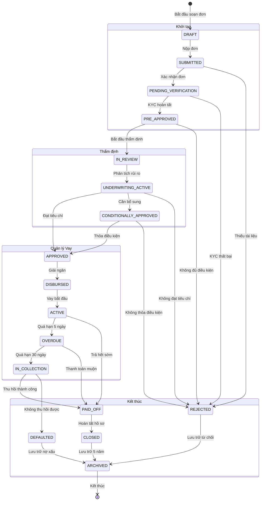

# Loan Application Flow Status Diagram

## Overview
This diagram shows the complete flow of a loan application.

## State Diagram

## State Descriptions

### 1. Khởi tạo (Origination)
- **DRAFT**: Đơn vay đang được soạn thảo
- **SUBMITTED**: Đơn đã được nộp
- **PENDING_VERIFICATION**: Đang chờ xác minh KYC
- **PRE_APPROVED**: Sơ bộ được chấp thuận

### 2. Thẩm định (Underwriting)
- **IN_REVIEW**: Đang trong quá trình xem xét
- **UNDERWRITING_ACTIVE**: Đang thẩm định tích cực
- **APPROVED**: Được chấp thuận hoàn toàn
- **CONDITIONALLY_APPROVED**: Chấp thuận có điều kiện

### 3. Quản lý Vay (Servicing)
- **DISBURSED**: Đã giải ngân
- **ACTIVE**: Khoản vay đang hoạt động
- **OVERDUE**: Quá hạn thanh toán
- **IN_COLLECTION**: Đang trong quá trình thu hồi

### 4. Kết thúc (Closure)
- **PAID_OFF**: Đã trả hết nợ
- **CLOSED**: Hồ sơ đã đóng
- **DEFAULTED**: Vỡ nợ
- **REJECTED**: Bị từ chối
- **ARCHIVED**: Đã lưu trữ

## Transition Rules

### Khởi tạo → Thẩm định
- Chỉ khi KYC hoàn tất và sơ bộ được chấp thuận
- Có thể bị từ chối nếu thiếu tài liệu hoặc không đủ điều kiện

### Thẩm định → Quản lý Vay
- Chỉ khi được chấp thuận hoàn toàn
- Có thể cần bổ sung tài liệu trước khi chấp thuận

### Quản lý Vay → Kết thúc
- Khi trả hết nợ hoặc vỡ nợ
- Tất cả hồ sơ cuối cùng đều được lưu trữ

## Business Rules

1. **KYC Verification**: Bắt buộc trước khi thẩm định
2. **Document Requirements**: Phải đầy đủ trước khi xem xét
3. **Payment Tracking**: Theo dõi chặt chẽ các khoản thanh toán
4. **Collection Process**: Bắt đầu sau 30 ngày quá hạn
5. **Archive Policy**: Lưu trữ tối thiểu 5 năm
