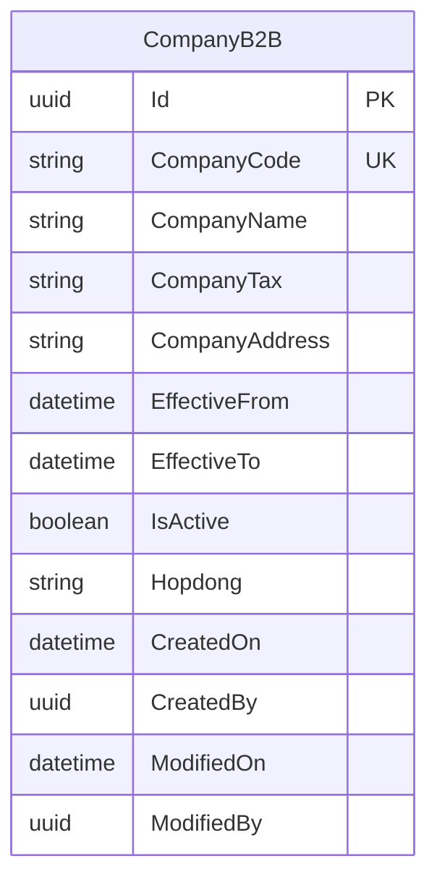
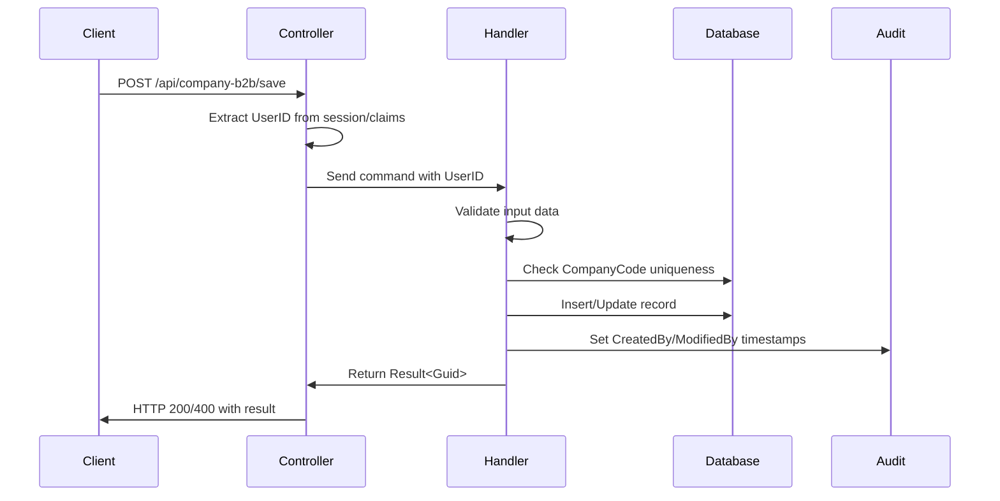
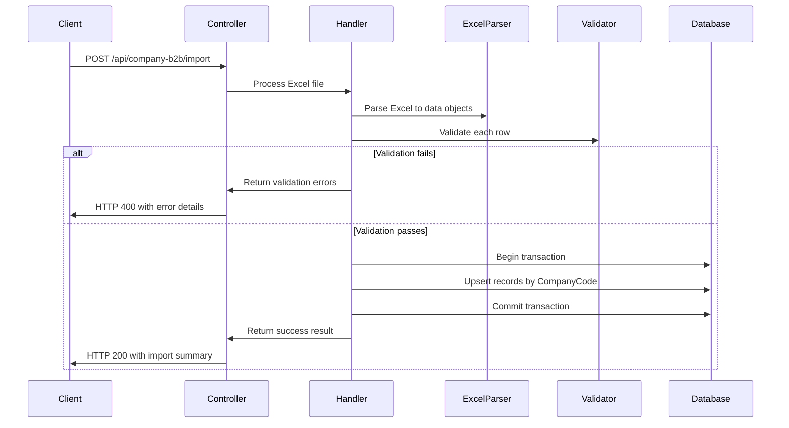
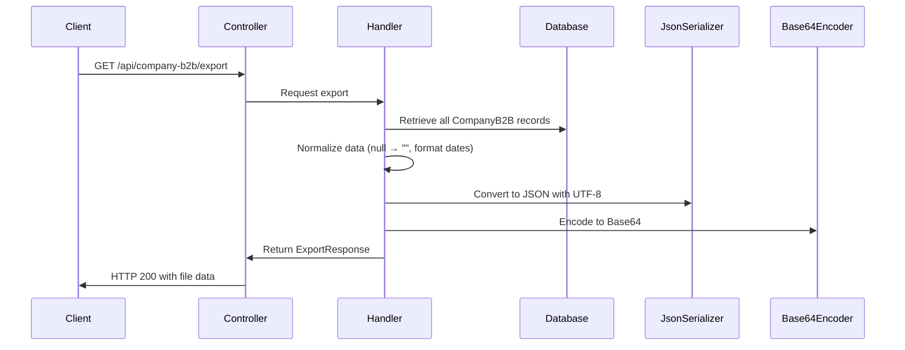

# Technical Design Document: CompanyB2B Management System

## 1. Overview

Xây dựng hệ thống quản lý CompanyB2B với đầy đủ các chức năng CRUD, import/export dữ liệu, và chuẩn hóa xử lý dữ liệu. Hệ thống đảm bảo tính nhất quán trong validation, null-handling, audit trail và hỗ trợ đa ngôn ngữ (tiếng Việt/Anh).

## 2. Requirements

### 2.1 Functional Requirements

* As a user, I want to create new CompanyB2B records so that I can manage business partner information
* As a user, I want to update existing CompanyB2B records so that I can keep information current
* As a user, I want to view a list of all CompanyB2B records so that I can browse and search through data
* As a user, I want to export CompanyB2B data to Excel format so that I can use it in external systems
* As a user, I want to import CompanyB2B data from Excel files so that I can bulk update information
* As a user, I want to see validation errors in Vietnamese so that I can understand and fix issues easily
* As a user, I want the system to handle null values consistently so that data display is uniform

### 2.2 Non-Functional Requirements

* The system should handle up to 10,000 records in import operations
* API responses should be consistent and standardized
* All error messages must be displayed in Vietnamese
* The system should maintain audit trails for all data changes
* Export operations should support UTF-8 encoding for Vietnamese characters
* API endpoints must be secured with JWT authentication

## 3. Technical Design

### 3.1. Data Model Changes

Không có thay đổi cấu trúc database. Sử dụng entity CompanyB2B hiện có với các trường:



**Validation Rules:**
- CompanyCode: Required, unique, max 50 chars
- CompanyName: Required, max 500 chars  
- CompanyTax: Optional, max 50 chars
- CompanyAddress: Optional, max 500 chars
- EffectiveFrom: Required, valid date
- EffectiveTo: Optional, must be >= EffectiveFrom
- Hopdong: Required, max 100 chars
- IsActive: Optional, boolean (default true)

### 3.2. API Changes

#### 3.2.1 CompanyB2B Controller Endpoints

**POST /api/company-b2b/save**
- Purpose: Create or update CompanyB2B record
- Request: CompanyB2BSaveRequest
- Response: Result<Guid> (ID of created/updated record)
- Handler: `ws_L_CompanyB2B_Save`

**GET /api/company-b2b/list**  
- Purpose: Retrieve all CompanyB2B records
- Response: List<CompanyB2BResponse>
- Handler: `ws_L_CompanyB2B_Get`

**POST /api/company-b2b/import**
- Purpose: Bulk import from Excel file
- Request: Multipart form with Excel file
- Response: ImportResult with validation errors
- Handler: `ws_L_CompanyB2B_Import`

**GET /api/company-b2b/export**
- Purpose: Export all data to JSON format
- Response: ExportResponse with base64 encoded data
- Handler: `ws_L_CompanyB2B_Export`

#### 3.2.2 Request/Response Models

```csharp
public record CompanyB2BSaveRequest(
    Guid? Id,           // null for create, existing ID for update
    string CompanyCode,
    string CompanyName, 
    string? CompanyTax,
    string? CompanyAddress,
    DateTime EffectiveFrom,
    DateTime? EffectiveTo,
    bool IsActive,
    string Hopdong,
    Guid? UserID        // Optional, auto-filled from session
);

public record CompanyB2BResponse(
    Guid Id,
    string CompanyCode,
    string CompanyName,
    string CompanyTax,      // Normalized to "" if null
    string CompanyAddress,  // Normalized to "" if null
    string EffectiveFrom,   // Format: yyyy-MM-dd
    string? EffectiveTo,    // Format: yyyy-MM-dd
    string IsActive,        // "Kích hoạt" or "Không kích hoạt"
    string Hopdong,
    string CreatedOn,       // Format: yyyy-MM-dd HH:mm:ss
    string ModifiedOn       // Format: yyyy-MM-dd HH:mm:ss
);

public record ImportResult(
    bool Success,
    List<ImportError> Errors,
    int TotalProcessed,
    int TotalImported
);

public record ImportError(
    int RowNumber,
    string FieldName,
    string ErrorMessage
);

public record ExportResponse(
    List<ExportFile> Table1
);

public record ExportFile(
    string FileName,
    string FileExtension,
    string FileData,        // Base64 encoded JSON
    int TotalCount,
    int FileSizeBytes,
    double FileSizeKB,
    double FileSizeMB,
    string ExportDate,
    string DataFormat,
    string ContentType
);
```

### 3.3. UI Changes

**Frontend Components (genie app):**
- CompanyB2B form component for create/edit
- CompanyB2B list component with sorting and filtering
- Import component with file upload and validation display
- Export component with download functionality
- Error message display in Vietnamese

### 3.4. Logic Flow

#### 3.4.1 Save Operation Flow



#### 3.4.2 Import Operation Flow



#### 3.4.3 Export Operation Flow



### 3.5. Dependencies

**Existing Dependencies:**
- Entity Framework Core for data access
- MediatR for CQRS pattern
- FluentValidation for input validation
- Newtonsoft.Json for JSON serialization

**New Dependencies:**
- EPPlus or ClosedXML for Excel file processing
- System.Text.Encoding for UTF-8 handling

### 3.6. Security Considerations

* JWT authentication required for all endpoints
* UserID extracted from session/claims for audit trail
* Input validation to prevent injection attacks
* File size limits for import operations (max 10MB)
* Row count limits for import operations (max 10,000)

### 3.7. Performance Considerations

* Database indexes on CompanyCode, CreatedOn, ModifiedOn
* Pagination for large datasets in future iterations
* Memory-efficient Excel processing for large files
* Base64 encoding increases file size by ~33%

## 4. Testing Plan

**Unit Tests:**
* Test all validation rules for CompanyB2B entity
* Test null-handling normalization logic
* Test audit trail creation and updates
* Test Excel import/export functionality

**Integration Tests:**
* Test complete API workflows (create → list → export)
* Test import validation and error handling
* Test authentication and authorization

**Performance Tests:**
* Test import with maximum allowed records (10,000)
* Test export performance with large datasets
* Test memory usage during file operations

## 5. Open Questions

* Should we implement pagination for the list endpoint in future versions?
* Do we need to support different Excel formats (xls, xlsx, csv)?
* Should we implement real-time progress tracking for large imports?

## 6. Alternatives Considered

* **CSV Import**: Rejected due to encoding issues with Vietnamese characters
* **Direct File Download**: Rejected in favor of Base64 for better error handling
* **Batch Processing**: Considered for large imports but rejected due to complexity
